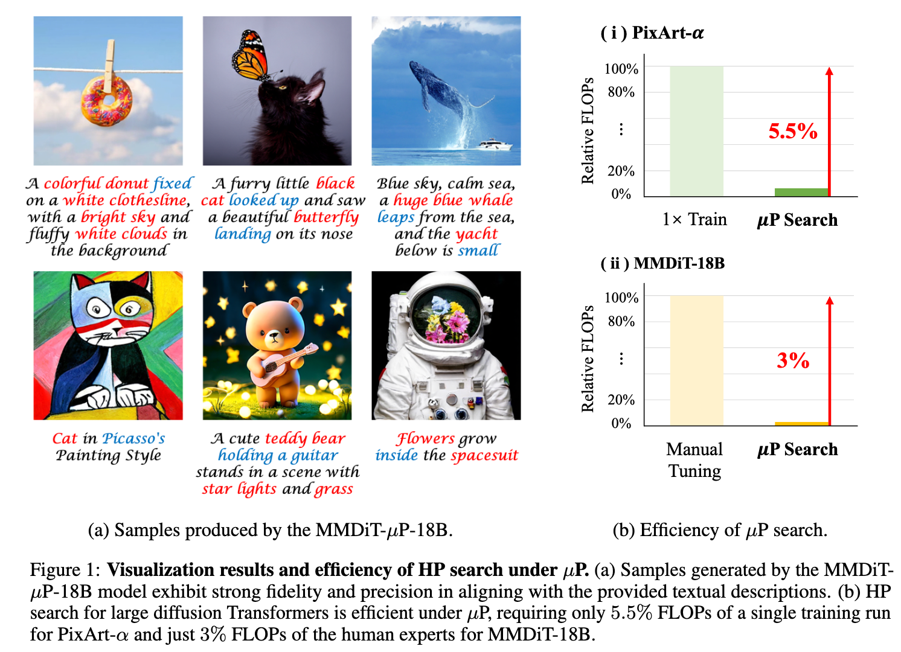

# Scaling Diffusion Transformers Efficiently via μP

This is the official implementation for our paper **"[Scaling Diffusion Transformers Efficiently via μP](https://arxiv.org/abs/2505.15270)"**. We verify that μP enables stable hyperparameter (HP) transfer from small to large diffusion Transformers, and dramatically reduces HP tuning costs at scale. As a result, diffusion Transformers under μP outperform their respective baselines while requiring small tuning cost (e.g., 3% FLOPs of human experts for MMDiT-18B).



## What is μP?

[Maximal Update Parametrization (μP)](https://github.com/microsoft/mup) was recently proposed as a promising solution to the HP selection problem for large models (e.g.,  vanilla Transformer). It stabilizes optimal HPs across different model widths, enabling direct transfer of HPs searched from small models to large models (a.k.a., μTransfer algorithm) and significantly reducing tuning costs at scale. Due to its strong transferability, μP has been applied to the pretraining of large language models (LLMs).

μP analytically adjusts the HPs of each weight based on the model's width and weight type (input, hidden, or output). These adjustments typically involve the weight multiplier, initialization variance, and learning rate. The implementation of μP is explained in detail in our paper and in the original [Maximal Update Parametrization (μP)](https://github.com/microsoft/mup) repository.

## What are our contributions?

1. We rigorously prove that μP of mainstream diffusion Transformers aligns with the [existing framework](https://arxiv.org/abs/2203.03466), enabling the direct application of existing [μP methodologies](https://github.com/microsoft/mup) .

2. We systematically demonstrate that DiT under μP enjoys robust HP transferability. Notably, DiT-XL-2-μP with transferred learning rate achieves 2.9 times faster convergence than the original DiT-XL-2.

   

3. We validate that diffusion Transformers under μP outperform their respective baselines while requiring small tuning cost (e.g., 3% FLOPs of human experts for MMDiT-18B).

In this repository, we provide the code and introduction to reproduce our experiments on DiT and PixArt-α. Our setup and codebase follow the remarkable [DiT](https://github.com/facebookresearch/DiT/blob/main/environment.yml),  [PixArt-α](https://github.com/PixArt-alpha/PixArt-alpha/blob/master/requirements.txt) and [Maximal Update Parametrization (μP)](https://github.com/microsoft/mup).

## Systematic investigation for DiT-μP on ImageNet

### Implementation of DiT-μP

We implement DiT-μP based on the [original codebase](https://github.com/microsoft/mup). We just need to adjust the weight multiplier and variance of each weight at initalization according to the μP theory. We then use the [MuAdamW optimizer](https://github.com/microsoft/mup/blob/19814971934ef91dd546f88e913fc963e096d11c/mup/optim.py#L83) from the [original codebase](https://github.com/microsoft/mup) to adjust learning rate of each weight at training. **Our modifications compared to the original DiT are marked with "# mup" in the code**.

We use the [coord_check](https://github.com/microsoft/mup?tab=readme-ov-file#coord-check) method to verify the correctness of DiT-μP. In the following figure, all curves stay horizontal, indicating that μP is implemented correctly.

```bash
python coordcheck.py --load_base_shapes width288_d28.bsh
```


### HP transferability

We verify that DiT under μP enjoys robust HP transferability as the following figures (Figure 3 in our paper).


We describe how to reproduce Figure 3(a) in our paper.

First, we need to train some DiTs with different widths and learning rates under μP. 

```bash
cd DiT/
torchrun --master_port=${MASTER_PORT} \
--master_addr=${MASTER_ADDR} \
--nproc_per_node=8 \ #A100-80G GPU
--nnodes=1 \
--node_rank=${NODE_RANK} \
train_mup.py \
--load_base_shapes width288_d28.bsh \
--mup \
--global_batch_size 256 \
--num_heads 4 \ # {2, 4, 8}
--epochs 40 \
--loglr -10 # {-9, -10, -11, -12, -13}
```

Second, we sample 50K images from these trained DiTs.

```bash
cd DiT
torchrun --master_port=${MASTER_PORT} \
--master_addr=${MASTER_ADDR} \
--nproc_per_node=8 \ # A100-80G or V100-32G
--nnodes=1 \
--node_rank=${NODE_RANK} \
sample_ddp.py \
--load_base_shapes width288_d28.bsh \
--mup \
--num_heads 4 \ # {2, 4, 8}
--ckpt path_ckpt.pth \
--cfg_scale 1 \
--vae mse
```

Third, we evaluate the performance (e.g., FID, IS, sFID) of these DiTs based on the [ADM codebase](https://github.com/openai/guided-diffusion).

```bash
cd DiT
python create_npz.py # get sampled_50K_images.npz
python evaluator.py \
--ref_batch path/VIRTUAL_imagenet256_labeled.npz \
--sample_batch sampled_50K_images.npz
```

Finally, we can plot the figures with these data.

### Pretrain DiT-XL-2-μP

The best learning rate searched in small models is $2^{-10}$, we then use it to pretrain the DiT-XL-2-μP.

```bash
cd DiT/
torchrun --master_port=${MASTER_PORT} \
--master_addr=${MASTER_ADDR} \
--nproc_per_node=8 \ # A100-80G
--nnodes=4 \
--node_rank=${NODE_RANK} \
train_mup.py \
--load_base_shapes width288_d28.bsh \
--mup \
--global_batch_size 256 \
--num_heads 16 \
--epochs 480 \
--loglr -10
```

To reproduce the original DiT-XL-2 pretraining, we can run

```bash
cd DiT/
torchrun --master_port=${MASTER_PORT} \
--master_addr=${MASTER_ADDR} \
--nproc_per_node=8 \ # A100-80G
--nnodes=4 \
--node_rank=${NODE_RANK} \
train_mup.py \
--global_batch_size 256 \
--num_heads 16 \
--epochs 1400
```

The sampling and evaluation are the same as before.

## Scaling PixArt-α-μP on SA-1B

### Dataset

We use the SA-1B/SAM dataset following the instructions in [PixArt-α repo](https://github.com/PixArt-alpha/PixArt-alpha/tree/master?tab=readme-ov-file#1-pixart-training).

### Implementation of PixArt-α-μP

**Our modifications on initialization compared with the original PixArt-α are marked with "# mup" in the code**. It correctness can also be verified by the [coord_check](https://github.com/microsoft/mup?tab=readme-ov-file#coord-check) method.

```bash
python scripts/coordcheck.py \
--load_base_shapes L28_width288.bsh \
--config configs/pixart_config/PixArt_mup_img256_SAM_coord.py \
--work_dir output/pixelart_coordcheck
```


### HP search on proxy models

To reproduce the results of base learning rate search on PixArt-α-μP proxy tasks (Table 2 in our paper), we run

```bash
cd PixArt-alpha-master/
torchrun --master_port=${MASTER_PORT} \
--master_addr=${MASTER_ADDR} \
--nproc_per_node=8 \ # A100-80G
--nnodes=1 \
--node_rank=${NODE_RANK} \
train_scripts/train.py \
--config configs/pixart_config/PixArt_mup_xl2_img256_SAM_proxy.py \
--work-dir output/search_SAM_256/loglr-10 \
--load_base_shapes L28_width288.bsh \
--loglr -10 # {-9, -10, -11, -12, -13}
```

### Pretrain PixArt-α-μP

We use the best base learning rate $2^{-10}$ to train the PixArt-α-μP.

```bash
cd PixArt-alpha-master/
torchrun --master_port=${MASTER_PORT} \
--master_addr=${MASTER_ADDR} \
--nproc_per_node=8 \ # A100-80G
--nnodes=4 \
--node_rank=${NODE_RANK} \
train_scripts/train.py \
--config configs/pixart_config/PixArt_mup_xl2_img256_SAM_target.py \
--work-dir output/pretrain_SAM_256_mup/loglr-10 \
--load_base_shapes L28_width288.bsh
```

To train the original PixArt-α, we can run

```bash
cd PixArt-alpha-master/
torchrun --master_port=${MASTER_PORT} \
--master_addr=${MASTER_ADDR} \
--nproc_per_node=8 \ # A100-80G
--nnodes=4 \
--node_rank=${NODE_RANK} \
train_scripts/train.py \
--config configs/pixart_config/PixArt_xl2_img256_SAM.py \
--work-dir output/train_SAM_256
```

### Evaluation

#### MS-COCO and MJHQ

First, to obtain FID and CLIP score on MS-COCO and MJHQ-30K dataset, we need to generate images with their prompts

```bash
python scripts/inference.py \
--config config_path.py \
--load_base_shapes L28_width288.bsh \
--model_path ckpt_path.pth \
--dataset mjhq # or mscoco
```

Second, the FID of two given image sets can be calculated by

```bash
python tools/fid.py \
--ref_dir data/mjhq/imgs \
--fake_dir sampled_imgs
```

Third, to obtain the CLIP score of sampled images, we can run

```bash
python tools/clip_score.py \
--image_dir sampled_imgs \
--save_path result.csv
```

#### GenEval

First, generate images with the prompts from GenEval

```bash
python scripts/inference_geneval.py \
--config config_path.py \
--load_base_shapes L28_width288.bsh \
--model_path ckpt_path.pth
```

Second, obtain the score

```bash
python tools/evaluate_geneval.py \
--imagedir sampled_imgs \
--outfile sampled_imgs.jsonl \
--model-path output/pretrained_models/mask2former

python tools/summary_scores.py sampled_imgs.jsonl
```

## Acknowledgement

This project is heavily based on the remarkable [DiT](https://github.com/facebookresearch/DiT/blob/main/environment.yml),  [PixArt-α](https://github.com/PixArt-alpha/PixArt-alpha/blob/master/requirements.txt) and [Maximal Update Parametrization (μP)](https://github.com/microsoft/mup). Thanks for their great work!

## Citation

If our paper **"[Scaling Diffusion Transformers Efficiently via μP](https://arxiv.org/abs/2505.15270)"** or this repository was useful to you, please cite:
